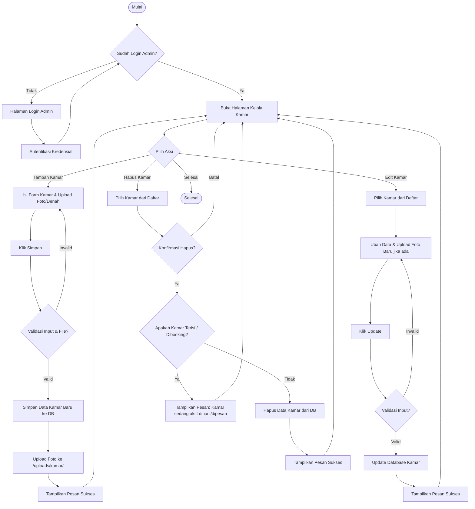
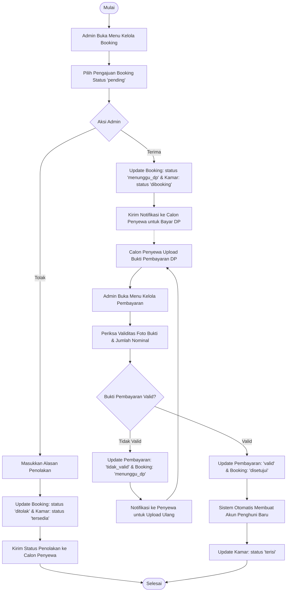
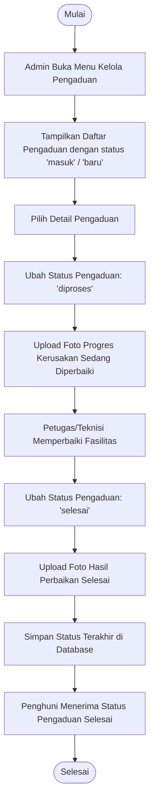
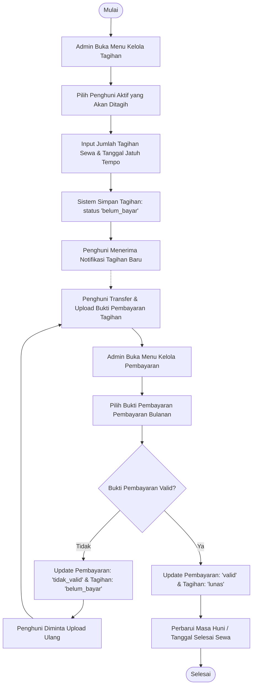
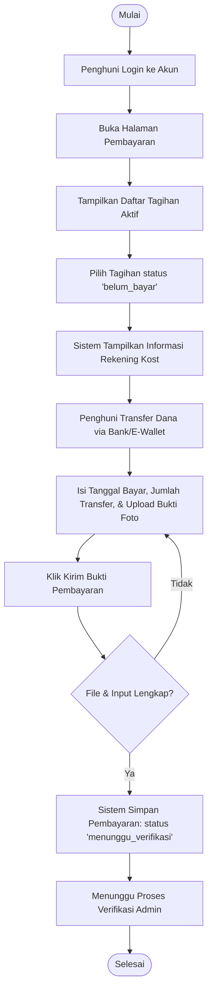
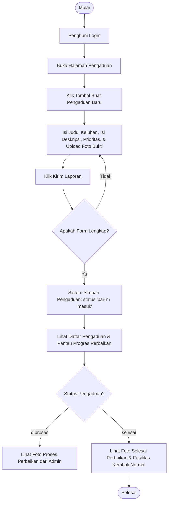
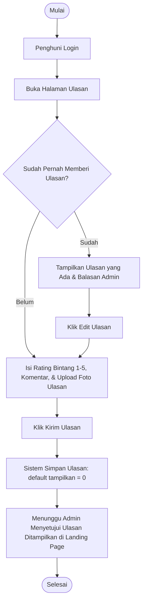
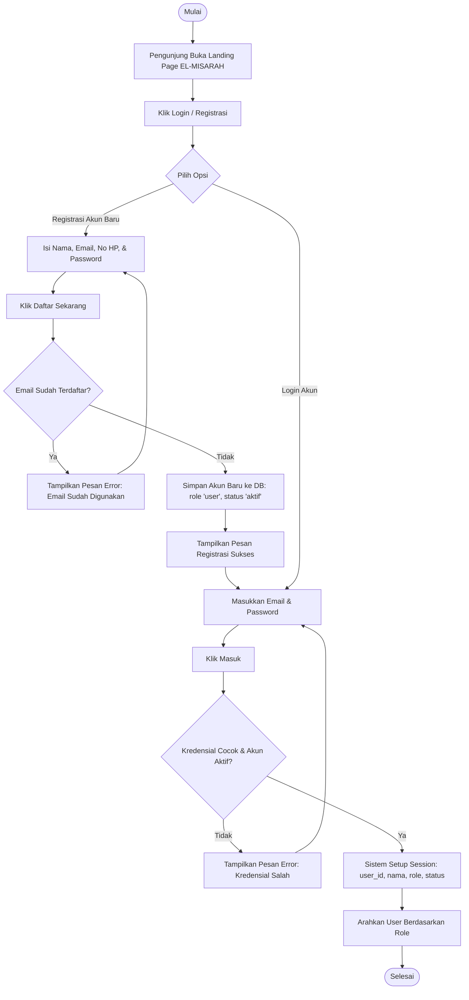
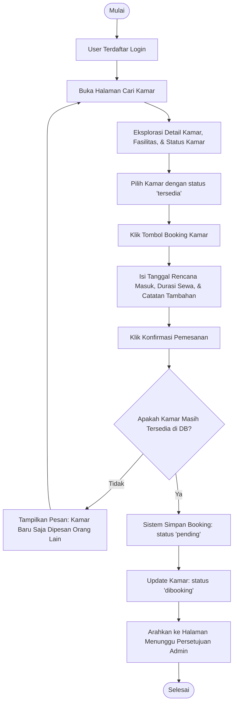
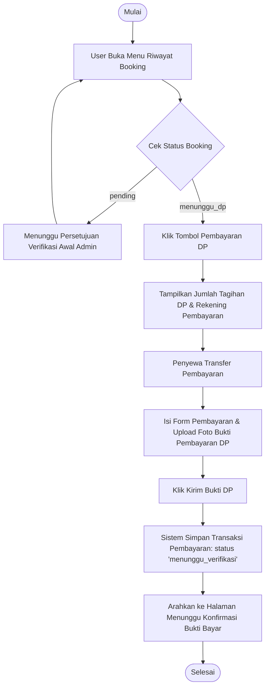

# Dokumen Activity Diagram - EL-MISARAH Kost Management System

Dokumen ini berisi pemetaan alur aktivitas (**Activity Diagram**) untuk sistem manajemen kost **EL-MISARAH**. Diagram di bawah didefinisikan menggunakan notasi **Mermaid** yang dapat dirender secara visual. Alur aktivitas disesuaikan dengan database schema dan alur logika aplikasi yang ada di folder [backend/](file:///d:/laragon/www/EL-MISARAH-main/backend) dan [frontend/](file:///d:/laragon/www/EL-MISARAH-main/frontend).

---

## Ringkasan Aktor dan Fitur Utama
Sistem ini membagi hak akses menjadi 3 jenis aktor utama:
1. **Admin**: Bertanggung jawab mengelola seluruh data master kost (kamar, user, pengumuman), memproses transaksi (booking, pembayaran, tagihan), dan menindaklanjuti pengaduan serta ulasan.
2. **Penghuni (Resident)**: Pengguna yang sudah aktif menempati kamar kost. Fitur utamanya mencakup pembayaran tagihan bulanan, pengajuan pengaduan kerusakan fasilitas, melihat pengumuman internal, dan menulis ulasan kost.
3. **User (Guest / Calon Penyewa)**: Pengguna umum atau calon penyewa yang melakukan eksplorasi kamar, melakukan registrasi akun, mengajukan pemesanan (booking), serta mengunggah bukti pembayaran DP booking awal.

---

## 1. Activity Diagram - Admin Per-Fitur

### 1.1. Kelola Data Kamar (CRUD Kamar)
Diagram ini menjelaskan alur admin saat menambah, memperbarui, atau menghapus data kamar pada menu `backend/admin/kelola_kamar`.

---

### 1.2. Kelola Booking & Pembayaran DP
Alur pemrosesan pengajuan sewa kamar oleh calon penyewa (status `pending` -> `menunggu_dp` -> `disetujui`) yang diakses pada menu `backend/admin/kelola_booking` dan `backend/admin/kelola_pembayaran`.

---

### 1.3. Kelola Pengaduan Kerusakan Fasilitas
Alur respon admin terhadap laporan kerusakan fasilitas yang dikirim oleh Penghuni di menu `backend/admin/kelola_pengaduan`.

---

### 1.4. Kelola Tagihan Bulanan & Verifikasi Pembayaran
Alur pembuatan tagihan periodik sewa kost dan verifikasi pembayarannya di menu `backend/admin/kelola_tagihan`.

---

## 2. Activity Diagram - Penghuni Per-Fitur

### 2.1. Pembayaran Tagihan Bulanan (Upload Bukti Bayar)
Alur bagi Penghuni untuk melihat dan melunasi tagihan kost bulanan melalui menu `backend/penghuni/pembayaran.php`.

---

### 2.2. Pengajuan Pengaduan Kerusakan
Alur bagi Penghuni untuk melaporkan kerusakan fasilitas di dalam kamar atau area kost melalui menu `backend/penghuni/buat_pengaduan.php` dan memantau perkembangannya di `backend/penghuni/riwayat_pengaduan.php`.

---

### 2.3. Pemberian Ulasan & Testimoni Kost
Alur bagi Penghuni yang aktif untuk memberikan rating dan tanggapan/testimoni terhadap pelayanan kost di menu `backend/penghuni/ulasan.php`.

---

## 3. Activity Diagram - User (Guest / Calon Penyewa) Per-Fitur

### 3.1. Pendaftaran Akun & Autentikasi (Registrasi & Login)
Alur bagi pengunjung umum (Guest) untuk membuat akun di website agar dapat melakukan pemesanan kamar kost di `frontend/pages/guest/profil.php`.

---

### 3.2. Eksplorasi Kamar & Pengajuan Booking
Alur bagi Calon Penyewa (User) untuk mengecek ketersediaan kamar dan melakukan booking melalui menu `frontend/pages/guest/rooms.php` dan `frontend/pages/guest/booking.php`.

---

### 3.3. Pembayaran DP Booking (Konfirmasi Pesanan)
Alur bagi Calon Penyewa untuk mengunggah bukti pembayaran DP setelah pengajuan booking disetujui oleh admin (status booking berubah menjadi `menunggu_dp`), melalui menu `frontend/pages/guest/pembayaran_booking.php`.

