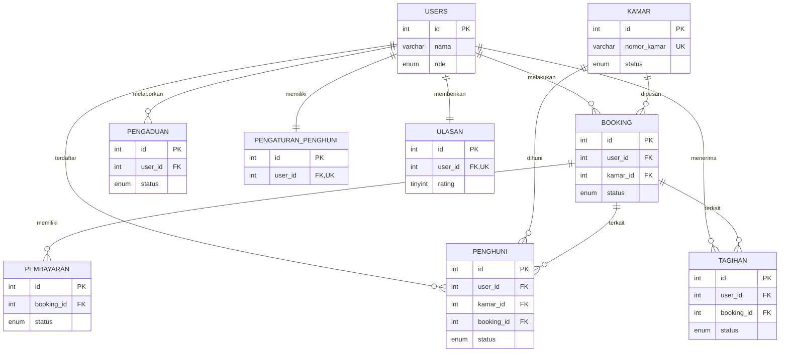
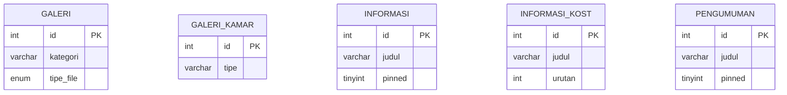

# Entity-Relationship Diagram (ERD) - EL-MISARAH Database (Lengkap)

Dokumen ini berisi visualisasi diagram ERD lengkap beserta penjelasan struktur tabel, tipe data, dan relasi antar-entitas untuk seluruh tabel aktif (15 tabel) di database lokal **EL-MISARAH** (`kost_elmisarah_main`) Anda. Sesuai instruksi Anda, tabel `visit` tidak dimasukkan ke dalam ERD karena sudah tidak digunakan.

---

## 1. Visualisasi Diagram ERD (Mermaid)

Berikut adalah diagram relasi lengkap antartabel dalam database. Diagram ini dirender menggunakan format Mermaid.

### 1.2. Tabel Master & Konten (Independen)

Tabel-tabel di bawah ini digunakan untuk mengelola konten dinamis pada antarmuka frontend/admin panel dan **tidak memiliki hubungan relasi fisik/langsung** dengan tabel inti lainnya.

---

## 2. Penjelasan Relasi Antartabel Utama (Logical & Physical Relations)

1. **`users` ke `booking` & `kamar` ke `booking`**
   - Transaksi utama pemesanan kamar kost menghubungkan pengguna (`users`) dengan kamar (`kamar`) melalui tabel jembatan `booking`.
   - Kedua relasi ini memiliki physical constraint `ON DELETE CASCADE`.

2. **`booking` ke `pembayaran`**
   - Setiap transaksi pemesanan (`booking`) dapat memiliki satu atau lebih catatan transaksi pembayaran (`pembayaran`) tergantung tipe/durasi pembayaran.

3. **`users` ke `pengaturan_penghuni` (One-to-One)**
   - Setiap pengguna memiliki tepat satu konfigurasi preferensi notifikasi di tabel `pengaturan_penghuni`. Diidentifikasi dengan Unique Key `user_id`.

4. **`users` ke `ulasan` (One-to-One)**
   - Setiap pengguna dapat memberikan maksimal satu ulasan (`ulasan`) di website. Diidentifikasi dengan Unique Key `user_id`.

5. **`users`, `kamar`, & `booking` ke `penghuni`**
   - Tabel `penghuni` menyimpan status sewa yang sedang aktif. Ia mereferensikan `users` (siapa penyewanya), `kamar` (kamar mana yang dihuni), dan `booking` (dari transaksi pemesanan yang mana).

6. **`users` & `booking` ke `tagihan`**
   - Tabel `tagihan` mencatat tagihan periodik sewa kost milik penyewa (`users`) berdasarkan transaksi `booking` mereka.

7. **`users` ke `pengaduan`**
   - Pengguna terdaftar (`users`) dapat mengajukan keluhan perbaikan fasilitas kost yang dicatat di tabel `pengaduan`.

8. **Tabel Statis Independen**
   - `galeri`, `galeri_kamar`, `informasi`, `informasi_kost`, dan `pengumuman` merupakan tabel master data pendukung konten frontend dan admin panel tanpa relasi langsung ke tabel lainnya.

---

## 3. Detail Kamus Data (Data Dictionary) Lengkap

### Tabel: `users`
Menyimpan data akun seluruh pengguna aplikasi (admin, calon penyewa, dan penghuni).
* **`id`** (INT, PK, Auto Increment)
* **`nama`** (VARCHAR(100)) - Nama lengkap
* **`email`** (VARCHAR(100), Unique Key) - Alamat email login
* **`password`** (VARCHAR(255)) - Hash password
* **`no_hp`** (VARCHAR(20)) - Nomor HP/WhatsApp
* **`no_ktp`** (VARCHAR(20), Nullable) - Nomor KTP penyewa
* **`foto_ktp`** (VARCHAR(255), Nullable) - Path berkas foto KTP
* **`role`** (ENUM('user','penghuni','admin')) - Hak akses
* **`alamat`** (TEXT, Nullable) - Alamat asal
* **`created_at`** (TIMESTAMP) - Waktu register
* **`status`** (ENUM('aktif','nonaktif')) - Status akun
* **`foto`** (VARCHAR(255), Nullable) - Foto profil pengguna
* **`tanggal_lahir`** (DATE, Nullable) - Tanggal lahir penyewa
* **`pekerjaan`** (VARCHAR(100), Nullable) - Pekerjaan penyewa
* **`kontak_darurat_nama`** (VARCHAR(100), Nullable) - Nama kontak darurat
* **`kontak_darurat_hubungan`** (VARCHAR(50), Nullable) - Hubungan dengan kontak darurat
* **`kontak_darurat_hp`** (VARCHAR(20), Nullable) - Nomor HP kontak darurat

### Tabel: `kamar`
Menyimpan informasi kamar kost dan variasi harga sewa.
* **`id`** (INT, PK, Auto Increment)
* **`nomor_kamar`** (VARCHAR(20), Unique Key) - Kode/nomor kamar (misal: A01)
* **`tipe`** (VARCHAR(50)) - Tipe Kamar
* **`harga`** (DECIMAL(12,2)) - Harga sewa per bulan
* **`status`** (ENUM('tersedia','dibooking','terisi')) - Status ketersediaan
* **`fasilitas`** (TEXT, Nullable) - List fasilitas
* **`deskripsi`** (TEXT, Nullable) - Keterangan/deskripsi kamar
* **`foto` s.d. `foto_5`** (VARCHAR(255), Nullable) - File path foto dokumentasi kamar
* **`foto_denah`** (VARCHAR(255), Nullable) - File path denah kamar
* **`created_at`** (TIMESTAMP)
* **`harga_3_bulan`** (INT, Nullable) - Paket diskon harga sewa per 3 bulan
* **`harga_6_bulan`** (INT, Nullable) - Paket diskon harga sewa per 6 bulan
* **`harga_tahun`** (INT, Nullable) - Paket diskon harga sewa per tahun

### Tabel: `booking`
Menyimpan pemesanan kamar yang diajukan oleh pengguna.
* **`id`** (INT, PK, Auto Increment)
* **`user_id`** (INT, FK -> `users.id`)
* **`kamar_id`** (INT, FK -> `kamar.id`)
* **`tanggal_booking`** (DATE) - Tanggal pengajuan pemesanan
* **`tanggal_masuk`** (DATE, Nullable) - Tanggal rencana mulai ngekost
* **`durasi_bulan`** (INT) - Durasi sewa (default 1 bulan)
* **`status`** (ENUM('pending','menunggu_dp','disetujui','aktif','ditolak','dibatalkan','selesai'))
* **`catatan`** (TEXT, Nullable)
* **`created_at`** (TIMESTAMP)
* **`alasan_penolakan`** (TEXT, Nullable) - Catatan admin jika pengajuan ditolak

### Tabel: `pembayaran`
Menyimpan transaksi bukti pembayaran sewa/DP.
* **`id`** (INT, PK, Auto Increment)
* **`booking_id`** (INT, FK -> `booking.id`)
* **`tanggal_bayar`** (DATE) - Tanggal pembayaran dilakukan
* **`jumlah`** (DECIMAL(12,2)) - Jumlah nominal transfer
* **`metode`** (VARCHAR(50), Nullable) - Metode pembayaran (transfer bank, dsb.)
* **`bukti_bayar`** (VARCHAR(255), Nullable) - Path file bukti upload pembayaran
* **`status`** (ENUM('menunggu_verifikasi','valid','tidak_valid')) - Status keabsahan bukti bayar
* **`created_at`** (TIMESTAMP)
* **`durasi_bulan`** (INT) - Durasi sewa yang dibayarkan
* **`jenis_pembayaran`** (VARCHAR(50), Nullable) - Jenis transaksi pembayaran (misal: "DP", "Pelunasan")

### Tabel: `pengaduan`
Menyimpan laporan pengaduan kerusakan/keluhan fasilitas dari penghuni kost.
* **`id`** (INT, PK, Auto Increment)
* **`user_id`** (INT, FK -> `users.id`)
* **`judul`** (VARCHAR(150)) - Subjek laporan pengaduan
* **`isi`** (TEXT) - Deskripsi detail keluhan
* **`no_kamar`** (VARCHAR(50), Nullable) - Kamar yang dilaporkan
* **`prioritas`** (ENUM('rendah','sedang','tinggi'))
* **`foto_bukti`** (VARCHAR(255), Nullable) - Bukti awal kerusakan
* **`foto_proses`** (VARCHAR(255), Nullable) - Foto saat pengerjaan/tindak lanjut
* **`foto_selesai`** (VARCHAR(255), Nullable) - Bukti keluhan selesai ditangani
* **`status`** (ENUM('masuk','diproses','selesai','baru'))
* **`created_at`** (TIMESTAMP)

### Tabel: `pengaturan_penghuni`
Preferensi notifikasi dan privasi bagi setiap penghuni.
* **`id`** (INT, PK, Auto Increment)
* **`user_id`** (INT, FK/UK -> `users.id`)
* **`notif_email`** (TINYINT(1)) - Aktifkan notifikasi email (0/1)
* **`notif_tagihan`** (TINYINT(1)) - Notifikasi tagihan baru (0/1)
* **`notif_pengumuman`** (TINYINT(1)) - Notifikasi berita/pengumuman (0/1)
* **`notif_pengaduan`** (TINYINT(1)) - Update notifikasi status aduan (0/1)
* **`privasi_profil`** (TINYINT(1)) - Set profil publik/private (0/1)
* **`sesi_aktif_notif`** (TINYINT(1)) (0/1)
* **`updated_at`** (DATETIME)

### Tabel: `penghuni`
Mencatat status sewa kamar yang sedang berlangsung secara historis & real-time.
* **`id`** (INT, PK, Auto Increment)
* **`user_id`** (INT, FK -> `users.id`)
* **`kamar_id`** (INT, FK -> `kamar.id`)
* **`booking_id`** (INT, FK -> `booking.id`, Nullable)
* **`tanggal_masuk`** (DATE, Nullable) - Tanggal resmi menghuni kamar
* **`tanggal_keluar`** (DATE, Nullable) - Tanggal akhir sewa / keluar kost
* **`status`** (ENUM('aktif','selesai','keluar')) - Status huni saat ini
* **`catatan`** (TEXT, Nullable)
* **`created_at`** (DATETIME)
* **`updated_at`** (DATETIME)

### Tabel: `tagihan`
Mencatat tagihan pembayaran sewa bulanan yang harus diselesaikan penyewa.
* **`id`** (INT, PK, Auto Increment)
* **`user_id`** (INT, FK -> `users.id`)
* **`booking_id`** (INT, FK -> `booking.id`, Nullable)
* **`jumlah`** (INT) - Nominal tagihan
* **`status`** (ENUM('belum_bayar','lunas','dibatalkan'))
* **`jatuh_tempo`** (DATE, Nullable) - Batas waktu pembayaran tagihan
* **`created_at`** (TIMESTAMP)

### Tabel: `ulasan`
Menyimpan rating dan tanggapan dari penyewa terhadap pelayanan kost.
* **`id`** (INT, PK, Auto Increment)
* **`user_id`** (INT, FK/UK -> `users.id`) - 1 user hanya bisa memberi 1 ulasan
* **`rating`** (TINYINT) - Bintang 1-5
* **`komentar`** (TEXT) - Isi testimoni
* **`created_at`** (DATETIME)
* **`updated_at`** (DATETIME)
* **`foto_ulasan`** (VARCHAR(255), Nullable) - File path gambar ulasan
* **`balasan_admin`** (TEXT, Nullable) - Jawaban/respon dari pengelola kost
* **`balasan_at`** (DATETIME, Nullable) - Waktu tanggapan admin ditulis
* **`tampilkan`** (TINYINT) - Visibilitas ulasan di halaman beranda (0 = sembunyikan, 1 = tampilkan)

### Tabel: `galeri`
Media dokumentasi fasilitas kost yang ditampilkan di halaman galeri.
* **`id`** (INT, PK, Auto Increment)
* **`kategori`** (VARCHAR(50)) - Kategori foto (misal: "kamar mandi", "lobi")
* **`tipe_file`** (ENUM('foto','video'))
* **`file_path`** (VARCHAR(255)) - Path berkas media
* **`caption`** (VARCHAR(255), Nullable) - Keterangan foto
* **`created_at`** (DATETIME)

### Tabel: `galeri_kamar`
Menyimpan foto spesifik berdasarkan tipe kamar.
* **`id`** (INT, PK, Auto Increment)
* **`tipe`** (VARCHAR(50)) - Nama tipe kamar (e.g., Standar, Exclusive)
* **`foto`** (VARCHAR(255)) - Path file foto kamar

### Tabel: `informasi`
Pengumuman, peraturan kost, atau jam operasional utama.
* **`id`** (INT, PK, Auto Increment)
* **`judul`** (VARCHAR(150))
* **`isi`** (TEXT)
* **`pinned`** (TINYINT(1)) - Apakah pengumuman disematkan di atas (0/1)
* **`created_at`** (TIMESTAMP)

### Tabel: `informasi_kost`
Detail informasi ringkas terkait kost (misal: Ikon, Judul, Deskripsi singkat) untuk landing page.
* **`id`** (INT, PK, Auto Increment)
* **`icon`** (VARCHAR(50)) - FontAwesome/Bootstrap Icon name
* **`judul`** (VARCHAR(100))
* **`deskripsi`** (TEXT)
* **`urutan`** (INT) - Posisi urutan tampil

### Tabel: `pengumuman`
Papan pengumuman/berita khusus untuk internal penghuni kost.
* **`id`** (INT, PK, Auto Increment)
* **`judul`** (VARCHAR(255))
* **`isi`** (TEXT)
* **`pinned`** (TINYINT(1)) - Apakah pengumuman diprioritaskan di atas (0/1)
* **`created_at`** (DATETIME)
