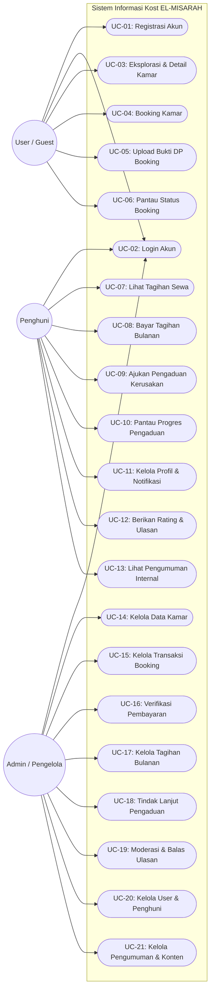

# Dokumen Use Case Diagram - EL-MISARAH Kost Management System

Dokumen ini berisi pemetaan **Use Case Diagram** untuk sistem manajemen kost **EL-MISARAH** menggunakan format **Mermaid**. Diagram ini menggambarkan interaksi antara berbagai aktor (Admin, Penghuni, dan User/Guest) dengan fitur-fitur yang disediakan oleh sistem.

---

## 1. Visualisasi Use Case Diagram (Mermaid)

Berikut adalah diagram Use Case yang memetakan hubungan antara aktor dengan fungsionalitas sistem. Anda dapat melihat pengelompokan *use case* berdasarkan batas sistem (*system boundary*).

---

## 2. Definisi Aktor

| No | Aktor | Deskripsi |
| :--- | :--- | :--- |
| 1 | **User / Guest** | Calon penyewa kost yang belum terikat kontrak sewa aktif. Berinteraksi dengan sistem untuk melihat kamar yang tersedia, mendaftar akun, melakukan booking, dan membayar DP awal. |
| 2 | **Penghuni** | Pengguna terdaftar yang sudah disetujui sewa kamarnya dan berstatus aktif menghuni kost. Memiliki hak akses ke modul transaksi tagihan bulanan, pengaduan fasilitas internal, dan pengaturan profil hunian. |
| 3 | **Admin / Pengelola** | Pengelola kost EL-MISARAH yang memiliki kendali penuh atas manajemen kamar, verifikasi pembayaran, tindak lanjut pengaduan kerusakan, pembuatan tagihan periodik, serta pemeliharaan konten informasi sistem. |

---

## 3. Kamus / Spesifikasi Use Case

### 3.1. Modul User / Guest (Calon Penyewa)
| Kode UC | Nama Use Case | Aktor Terkait | Deskripsi Singkat |
| :--- | :--- | :--- | :--- |
| **UC-01** | Registrasi Akun | User / Guest | Pengunjung melakukan pendaftaran akun baru menggunakan nama, email, no HP, dan password. |
| **UC-02** | Login Akun | User, Penghuni, Admin | Proses masuk ke sistem menggunakan email dan password untuk mendapatkan hak akses sesuai role. |
| **UC-03** | Eksplorasi & Detail Kamar | User / Guest | Melihat daftar kamar kost beserta spesifikasi fasilitas, foto dokumentasi, status ketersediaan, dan denah kamar. |
| **UC-04** | Booking Kamar | User / Guest | Mengajukan sewa kamar kost yang berstatus 'tersedia' dengan mengisi durasi sewa, tanggal mulai masuk, dan catatan. |
| **UC-05** | Upload Bukti DP Booking | User / Guest | Mengunggah bukti pembayaran uang muka (DP) setelah booking diverifikasi awal oleh admin. |
| **UC-06** | Pantau Status Booking | User / Guest | Melihat riwayat pemesanan kamar dan memantau status persetujuan transaksi dari admin. |

### 3.2. Modul Penghuni (Resident)
| Kode UC | Nama Use Case | Aktor Terkait | Deskripsi Singkat |
| :--- | :--- | :--- | :--- |
| **UC-07** | Lihat Tagihan Sewa | Penghuni | Melihat daftar kewajiban tagihan bulanan sewa kost yang diterbitkan admin. |
| **UC-08** | Bayar Tagihan Bulanan | Penghuni | Melakukan konfirmasi pembayaran sewa dengan mengunggah foto struk transfer bank/bukti pembayaran digital. |
| **UC-09** | Ajukan Pengaduan Kerusakan | Penghuni | Melaporkan kerusakan fasilitas kost disertai deskripsi keluhan, tingkat prioritas, dan foto kondisi kerusakan. |
| **UC-10** | Pantau Progres Pengaduan | Penghuni | Melihat riwayat aduan yang diajukan beserta foto pengerjaan (proses/selesai) dari tim pengelola kost. |
| **UC-11** | Kelola Profil & Notifikasi | Penghuni | Memperbarui data diri, nomor kontak darurat, ganti password, serta mengatur notifikasi (email/tagihan). |
| **UC-12** | Berikan Rating & Ulasan | Penghuni | Memberikan penilaian kepuasan (rating bintang 1-5) dan testimoni tertulis beserta foto untuk landing page. |
| **UC-13** | Lihat Pengumuman Internal | Penghuni | Membaca papan pengumuman/berita khusus dari admin untuk penghuni kost. |

### 3.3. Modul Admin (Pengelola Kost)
| Kode UC | Nama Use Case | Aktor Terkait | Deskripsi Singkat |
| :--- | :--- | :--- | :--- |
| **UC-14** | Kelola Data Kamar | Admin | Melakukan manajemen data kamar kost (Tambah, Tampil, Edit, Hapus) beserta status ketersediaannya. |
| **UC-15** | Kelola Transaksi Booking | Admin | Meninjau pengajuan sewa kamar kost dari user (menerima atau menolak dengan mencantumkan alasan penolakan). |
| **UC-16** | Verifikasi Pembayaran | Admin | Memvalidasi bukti transfer pembayaran yang diunggah oleh user (untuk DP) dan penghuni (untuk tagihan bulanan). |
| **UC-17** | Kelola Tagihan Bulanan | Admin | Membuat lembar tagihan sewa bulanan baru untuk penghuni kost aktif secara periodik. |
| **UC-18** | Tindak Lanjut Pengaduan | Admin | Mengubah status aduan menjadi 'diproses' dan 'selesai' serta mengunggah dokumentasi foto bukti perbaikan. |
| **UC-19** | Moderasi & Balas Ulasan | Admin | Menentukan apakah ulasan penghuni ditampilkan di landing page, serta membalas ulasan yang dikirimkan. |
| **UC-20** | Kelola User & Penghuni | Admin | Manajemen data user terdaftar, assign kamar penghuni, registrasi manual penghuni, serta memproses check-out. |
| **UC-21** | Kelola Pengumuman & Konten | Admin | Mengelola postingan informasi landing page (informasi kost, faq, galeri media) dan pengumuman internal. |
